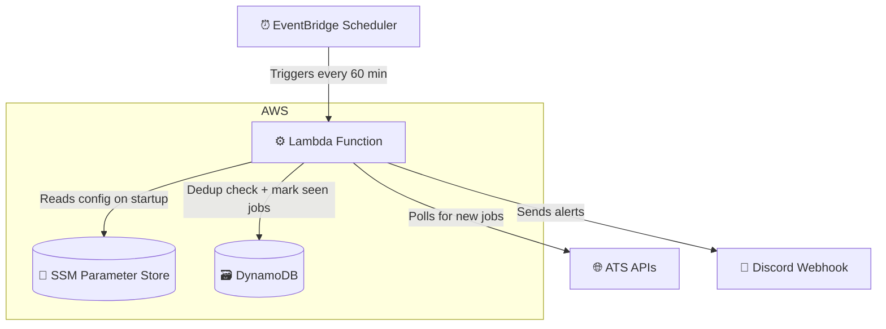

# Job Alert System

Most job boards allow you to create alerts to be notified whenever new roles are posted,
sometimes as frequently as daily. But even "daily" didn't fit my needs — some jobs would
miss the cut by being posted after an alert fired, already sitting at 100+ applicants by
the time I saw them. Others wouldn't show the location upfront, or would direct me to the
job board first instead of directly to the application page. I needed something more granular.

So I built an automated system to solve all of that.

Most companies today use an ATS to manage job postings — Greenhouse alone works with over
7,500 companies. Many of these platforms offer public APIs, which is how most job boards
populate their listings. This system works the same way: it polls those APIs directly and
delivers new postings straight to my personal Discord server every hour. Each alert
includes the job title, company, location, and a direct link to the application page — so
at most, I'm seeing a new role an hour after it's posted, with everything I need to decide
whether to apply.

For a breakdown of how it's built, see the [Architecture](#architecture) section below.

## Architecture

## Tech Stack

| Technology                                          | Role                    | Why                                                                                 |
|-----------------------------------------------------|-------------------------|-------------------------------------------------------------------------------------|
| Java 25                                             | Application language    | My "bread and butter"; plain Java avoids Spring Boot cold start penalties on Lambda |
| AWS Lambda                                          | Compute                 | Serverless, no idle cost, free tier covers this workload entirely                   |
| AWS EventBridge Scheduler                           | Trigger                 | Manages cron scheduling; kicks off Lambda every 60 minutes                          |
| AWS DynamoDB                                        | Deduplication store     | Serverless, permanent free tier, native TTL support for automatic job expiry        |
| AWS SSM Parameter Store                             | Secret + config storage | Securely stores personal webhook URL and keeps slug list out of source code         |
| Discord Webhook                                     | Notifications           | Free, instant, delivers push notifications to phone or computer via the Discord app |
| Greenhouse, Lever, Ashby, SmartRecruiters, Workable | Job board data sources  | All offer free public APIs requiring no authentication                              |
| Jackson 3.x                                         | JSON parsing            | Industry standard; used to parse all ATS API responses                              |
| Maven Shade Plugin                                  | Build                   | Packages all dependencies into a single fat JAR for Lambda deployment               |

## How It Works

Every 60 minutes, EventBridge triggers the Lambda function. On startup, Lambda reads the
Discord webhook URL and company slug list from SSM Parameter Store. It then polls each
configured ATS API concurrently using virtual threads, filters results down to only roles posted within the last
24 hours, checks DynamoDB to skip anything already seen, and sends matching alerts to
Discord. Each alert includes the job title, company, location, and a direct link to the
application page.
If a company's API endpoint stops responding, the system tracks consecutive failures and
automatically suppresses the company slug after three strikes, sending a Discord alert so it can
be investigated.

## Note

This is a personal utility built for my own job search. It isn't intended for general
use — running it requires your own AWS account, SSM parameters, Discord webhook, and
company slug list.

